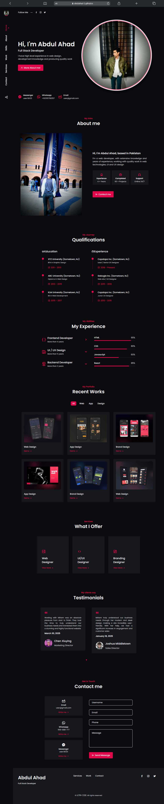

# Personal Portfolio Website

🚀 A dark, modern, and responsive developer portfolio to showcase my skills and projects.

🌐 **Live Preview:**  
[Click here to view the site](https://abdulahad-2.github.io/abdulahad-2.portfolio.io/)

---

## 🔥 Features

- Fully responsive on mobile, tablet, and desktop
- Modern dark UI with smooth animations
- Sections: Home, About, Projects, Contact
- Easy to customize HTML/CSS/JS structure

---

## 📸 Screenshots



> Tip: Upload a `screenshot.png` image in your repo so this preview works.

---

## ⚙️ Built With

- HTML5  
- CSS3 (Flexbox + Grid)  
- JavaScript (Vanilla)  
- Hosted with GitHub Pages

---

## 📁 Folder Structure

```bash
├── index.html
├── style.css
├── script.js
├── images/
└── README.md
